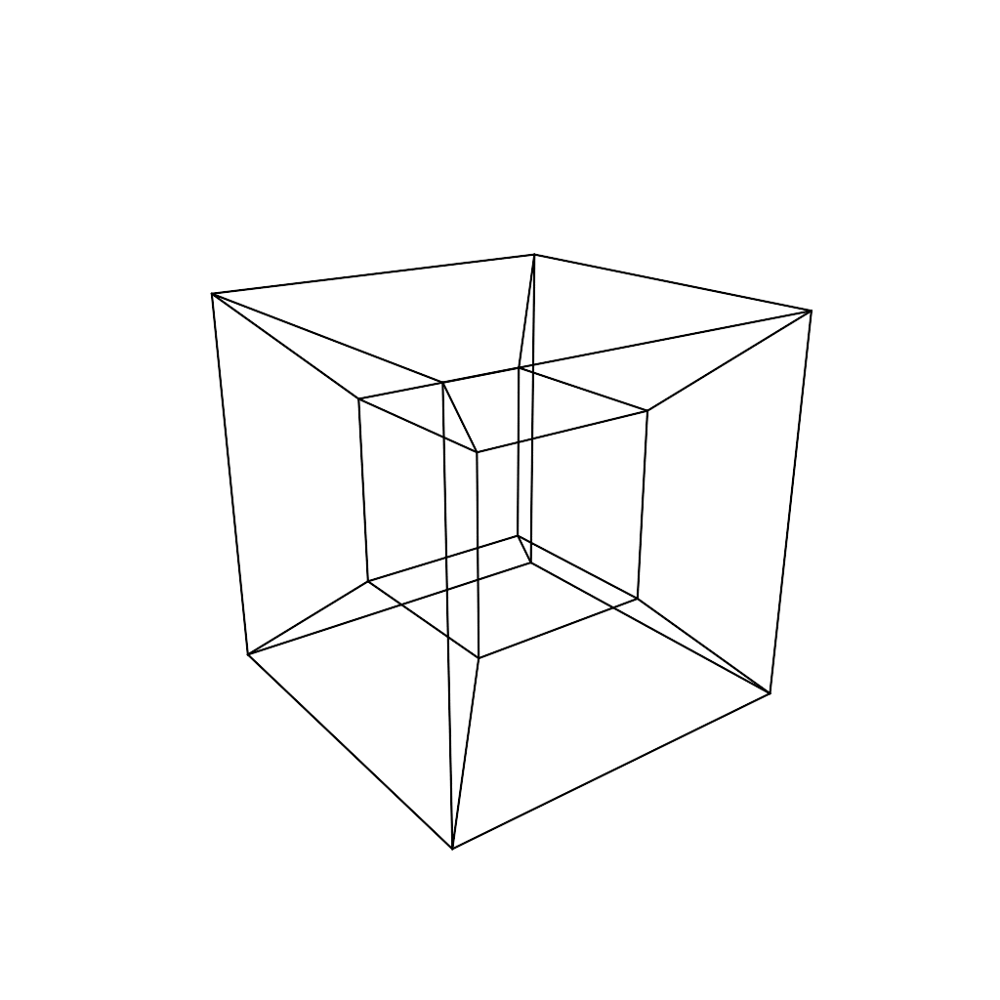

# hypercube

A simple hypercube/tesseract animation. Created in Go using the awesome [ln](https://github.com/fogleman/ln) library. An older implementation in three.js also exists in the `js` folder.

  

### License

MIT
